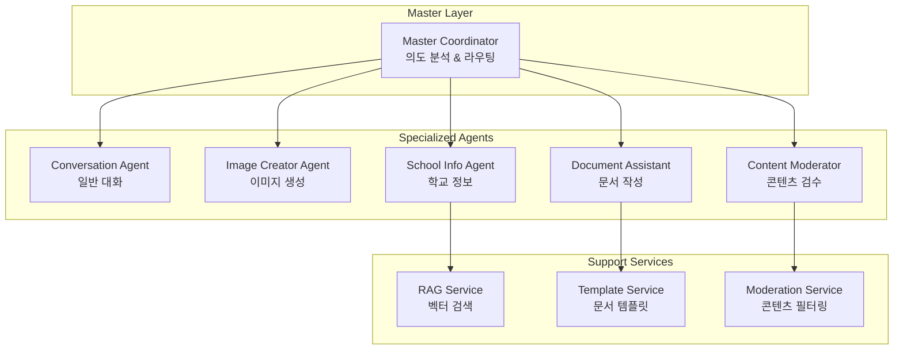
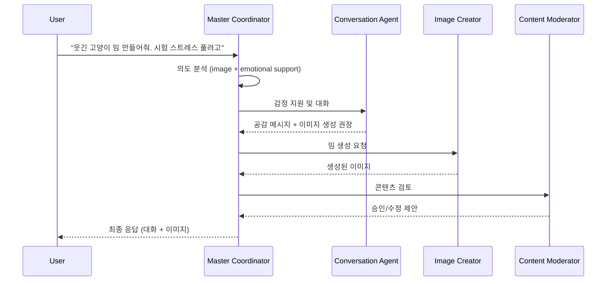

# AI 에이전트 설계서

## 🤖 에이전트 아키텍처 개요

### 계층적 에이전트 구조



## 🎯 Master Coordinator

### 역할 및 책임
- 사용자 입력 의도 분석
- 적절한 전문 에이전트 선택 및 라우팅
- 다중 에이전트 협업 조정
- 응답 통합 및 품질 관리

### 의도 분류 시스템

```typescript
interface IntentClassification {
  category: 'chat' | 'image' | 'document' | 'info' | 'moderation';
  confidence: number;
  entities: {
    type: string;
    value: string;
    confidence: number;
  }[];
  context: {
    previousIntent?: string;
    sessionType?: string;
    userPreferences?: object;
  };
}

class MasterCoordinator {
  async analyzeIntent(input: string, context: SessionContext): Promise<IntentClassification> {
    // GPT-4를 사용한 의도 분석
    const prompt = `
    사용자 입력을 분석하여 다음 카테고리 중 하나로 분류하세요:
    - chat: 일반 대화, 상담, 질문
    - image: 이모티콘, 밈, 이미지 생성 요청
    - document: PPT, 레포트, 문서 작성 도움
    - info: 학교 정보, 에브리타임 관련 질문
    - moderation: 부적절한 콘텐츠 검수 필요

    입력: "${input}"
    이전 컨텍스트: ${JSON.stringify(context)}
    `;

    // LLM 호출 및 분석 결과 반환
  }

  async routeToAgent(classification: IntentClassification, input: string): Promise<AgentResponse> {
    switch (classification.category) {
      case 'chat':
        return this.conversationAgent.process(input, classification);
      case 'image':
        return this.imageCreatorAgent.process(input, classification);
      case 'document':
        return this.documentAssistant.process(input, classification);
      case 'info':
        return this.schoolInfoAgent.process(input, classification);
      default:
        return this.conversationAgent.process(input, classification);
    }
  }
}
```

## 💬 Conversation Agent

### 기능
- 일반적인 대화 처리
- 학교 생활 상담 및 조언
- 감정 지원 및 공감 대화
- 학습 동기 부여

### 특화 기능

```typescript
class ConversationAgent {
  private personality = {
    tone: 'friendly',
    empathy: 'high',
    helpfulness: 'proactive',
    knowledge: 'university_life'
  };

  async processConversation(input: string, context: ConversationContext): Promise<ConversationResponse> {
    // 감정 분석
    const emotion = await this.analyzeEmotion(input);

    // 상황별 응답 생성
    const responseType = this.determineResponseType(emotion, context);

    // 개인화된 응답 생성
    const response = await this.generateResponse(input, context, responseType);

    return {
      message: response,
      emotion: emotion,
      suggestions: this.generateSuggestions(context),
      followUp: this.generateFollowUp(responseType)
    };
  }

  private async analyzeEmotion(input: string): Promise<EmotionAnalysis> {
    // 감정 분석 로직 (기쁨, 슬픔, 스트레스, 흥미 등)
  }

  private generateSuggestions(context: ConversationContext): string[] {
    // 상황에 맞는 제안 생성 (공부법, 동아리, 진로 등)
  }
}
```

## 🎨 Image Creator Agent

### 기능
- 이모티콘 및 밈 생성
- 스타일 일관성 유지
- 사용자 선호도 학습
- 콘텐츠 최적화

### 이미지 생성 파이프라인

```typescript
class ImageCreatorAgent {
  async createImage(request: ImageRequest): Promise<ImageResponse> {
    // 1. 프롬프트 최적화
    const optimizedPrompt = await this.optimizePrompt(request);

    // 2. 스타일 적용
    const styledPrompt = this.applyStyle(optimizedPrompt, request.style);

    // 3. 이미지 생성
    const image = await this.generateImage(styledPrompt);

    // 4. 후처리
    const processedImage = await this.postProcess(image, request);

    // 5. 메타데이터 생성
    const metadata = this.generateMetadata(request, processedImage);

    return {
      imageUrl: processedImage.url,
      thumbnailUrl: processedImage.thumbnailUrl,
      metadata: metadata,
      suggestions: this.generateVariationSuggestions(request)
    };
  }

  private async optimizePrompt(request: ImageRequest): Promise<string> {
    const prompt = `
    다음 요청을 이미지 생성에 최적화된 프롬프트로 변환하세요:
    요청: "${request.description}"
    스타일: ${request.style}
    용도: ${request.purpose} (이모티콘/밈/스티커)

    최적화 기준:
    - 구체적인 시각적 요소
    - 색상 및 스타일 지정
    - 감정 표현 강화
    - 한국 대학생 문화 반영
    `;

    return await this.llm.generate(prompt);
  }

  private generateVariationSuggestions(request: ImageRequest): string[] {
    return [
      '다른 표정으로 만들기',
      '색상 바꾸기',
      '배경 추가하기',
      '텍스트 넣기'
    ];
  }
}
```

## 📄 Document Assistant

### 기능
- PPT 슬라이드 구조 제안
- 레포트 개요 작성
- 참고문헌 정리
- 발표 스크립트 생성

### 문서 생성 시스템

```typescript
class DocumentAssistant {
  private templates = {
    presentation: new PresentationTemplate(),
    report: new ReportTemplate(),
    proposal: new ProposalTemplate()
  };

  async createDocument(request: DocumentRequest): Promise<DocumentResponse> {
    // 1. 문서 유형 결정
    const documentType = this.classifyDocumentType(request);

    // 2. 템플릿 선택
    const template = this.selectTemplate(documentType, request);

    // 3. 내용 생성
    const content = await this.generateContent(request, template);

    // 4. 구조화
    const structuredDoc = this.structureDocument(content, template);

    // 5. 포맷팅
    const formattedDoc = this.formatDocument(structuredDoc, request.format);

    return {
      document: formattedDoc,
      outline: structuredDoc.outline,
      suggestions: this.generateImprovementSuggestions(request),
      resources: this.findRelevantResources(request.topic)
    };
  }

  private async generateContent(request: DocumentRequest, template: Template): Promise<DocumentContent> {
    const sections = template.getSections();
    const content: DocumentContent = {};

    for (const section of sections) {
      const sectionPrompt = `
      다음 섹션의 내용을 작성하세요:
      섹션: ${section.name}
      목적: ${section.purpose}
      주제: ${request.topic}
      대상: ${request.audience}
      길이: ${section.expectedLength}

      요구사항:
      - 한국 대학생 수준에 맞는 내용
      - 학술적이지만 이해하기 쉬운 표현
      - 구체적인 예시 포함
      `;

      content[section.name] = await this.llm.generate(sectionPrompt);
    }

    return content;
  }
}
```

## 🏫 School Info Agent

### 기능
- 에브리타임 데이터 기반 질의응답
- 학교 공식 정보 제공
- 학사 일정 및 규정 안내
- 과목 정보 및 리뷰 제공

### RAG 시스템 통합

```typescript
class SchoolInfoAgent {
  private ragService: RAGService;
  private knowledgeBase: SchoolKnowledgeBase;

  async processQuery(query: string, context: QueryContext): Promise<InfoResponse> {
    // 1. 쿼리 분석 및 분류
    const queryType = await this.classifyQuery(query);

    // 2. 관련 문서 검색
    const relevantDocs = await this.ragService.search(query, queryType);

    // 3. 컨텍스트 생성
    const searchContext = this.buildContext(relevantDocs, context);

    // 4. 답변 생성
    const answer = await this.generateAnswer(query, searchContext);

    // 5. 신뢰도 검증
    const confidence = this.calculateConfidence(answer, relevantDocs);

    return {
      answer: answer,
      sources: relevantDocs.map(doc => doc.source),
      confidence: confidence,
      relatedQuestions: this.generateRelatedQuestions(query),
      lastUpdated: this.getLastUpdateTime(relevantDocs)
    };
  }

  private async classifyQuery(query: string): Promise<QueryType> {
    const categories = [
      'course_info',      // 과목 정보
      'graduation_req',   // 졸업 요건
      'academic_calendar', // 학사 일정
      'facility_info',    // 시설 정보
      'club_activity',    // 동아리/동아리
      'campus_life',      // 캠퍼스 생활
      'everytime_post'    // 에브리타임 게시글
    ];

    const prompt = `
    다음 질문을 카테고리로 분류하세요:
    질문: "${query}"
    카테고리: ${categories.join(', ')}
    `;

    return await this.llm.classify(prompt, categories);
  }

  private async generateAnswer(query: string, context: SearchContext): Promise<string> {
    const prompt = `
    다음 정보를 바탕으로 질문에 답변하세요:

    질문: "${query}"

    관련 정보:
    ${context.documents.map(doc => `
    출처: ${doc.source}
    내용: ${doc.content}
    신뢰도: ${doc.confidence}
    `).join('\n')}

    답변 가이드라인:
    - 정확하고 최신 정보만 사용
    - 불확실한 내용은 명시적으로 표시
    - 출처를 명확히 표기
    - 한국 대학생이 이해하기 쉬운 언어 사용
    - 필요시 추가 확인 방법 제시
    `;

    return await this.llm.generate(prompt);
  }
}
```

## 🛡️ Content Moderator Agent

### 기능
- 생성된 이미지 적절성 검사
- 텍스트 콘텐츠 필터링
- 사용자 신고 처리
- 자동 분류 및 조치

### 모더레이션 시스템

```typescript
class ContentModeratorAgent {
  private moderationRules = {
    image: new ImageModerationRules(),
    text: new TextModerationRules(),
    user: new UserModerationRules()
  };

  async moderateContent(content: Content): Promise<ModerationResult> {
    const results: ModerationResult = {
      approved: false,
      violations: [],
      confidence: 0,
      actions: []
    };

    // 1. 콘텐츠 유형별 검사
    if (content.type === 'image') {
      const imageResult = await this.moderateImage(content);
      results.violations.push(...imageResult.violations);
    }

    if (content.text) {
      const textResult = await this.moderateText(content.text);
      results.violations.push(...textResult.violations);
    }

    // 2. 종합 판단
    results.approved = results.violations.length === 0;
    results.confidence = this.calculateConfidence(results.violations);

    // 3. 조치 결정
    results.actions = this.determineActions(results);

    return results;
  }

  private async moderateImage(content: ImageContent): Promise<ImageModerationResult> {
    // OpenAI Vision API 또는 AWS Rekognition 사용
    const analysis = await this.visionAPI.analyze(content.imageUrl);

    return {
      violations: this.checkImageViolations(analysis),
      categories: analysis.categories,
      adultContent: analysis.adultContent,
      violence: analysis.violence
    };
  }

  private async moderateText(text: string): Promise<TextModerationResult> {
    const prompt = `
    다음 텍스트를 한국 대학교 커뮤니티 가이드라인에 따라 검토하세요:

    텍스트: "${text}"

    검토 항목:
    - 욕설 및 비속어
    - 차별적 표현
    - 개인정보 노출
    - 스팸성 내용
    - 부적절한 성적 표현
    - 폭력적 내용

    결과를 JSON 형태로 반환하세요.
    `;

    return await this.llm.moderate(prompt);
  }
}
```

## 🔄 에이전트 협업 패턴

### 멀티 에이전트 워크플로우



이 AI 에이전트 시스템은 각 전문 분야의 특성을 살려 사용자에게 최적화된 경험을 제공하며, 지속적인 학습을 통해 성능을 개선해 나갑니다.