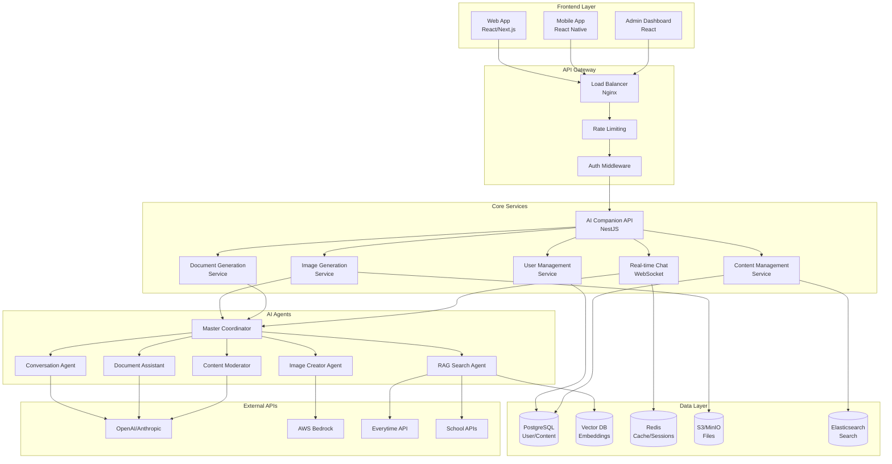
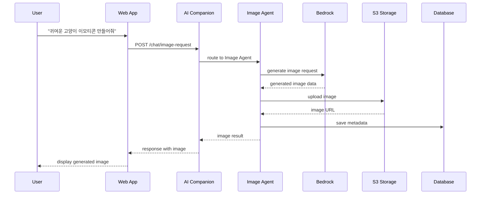
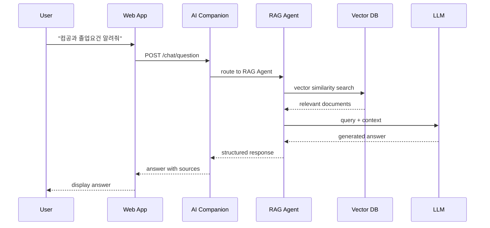

# 시스템 아키텍처 설계서

## 🏗️ 전체 시스템 구조

### Mermaid 다이어그램



## 🔄 데이터 플로우

### 이미지 생성 워크플로우



### RAG 검색 워크플로우



## 🗄️ 데이터베이스 스키마

### 핵심 테이블 구조

```sql
-- 사용자 프로필 확장
CREATE TABLE user_profiles (
    id UUID PRIMARY KEY,
    user_id UUID REFERENCES users(id),
    university VARCHAR(100),
    major VARCHAR(100),
    year INTEGER,
    preferences JSONB,
    statistics JSONB,
    created_at TIMESTAMP DEFAULT NOW(),
    updated_at TIMESTAMP DEFAULT NOW()
);

-- 이모티콘/밈 콘텐츠
CREATE TABLE emoticon_content (
    id UUID PRIMARY KEY,
    creator_id UUID REFERENCES users(id),
    title VARCHAR(255),
    tags TEXT[],
    image_url TEXT NOT NULL,
    thumbnail_url TEXT,
    category VARCHAR(50) CHECK (category IN ('emoticon', 'meme', 'sticker')),
    is_public BOOLEAN DEFAULT false,
    likes INTEGER DEFAULT 0,
    uses INTEGER DEFAULT 0,
    downloads INTEGER DEFAULT 0,
    moderation_status VARCHAR(20) DEFAULT 'pending',
    created_at TIMESTAMP DEFAULT NOW(),
    updated_at TIMESTAMP DEFAULT NOW()
);

-- 채팅 세션
CREATE TABLE chat_sessions (
    id UUID PRIMARY KEY,
    user_id UUID REFERENCES users(id),
    type VARCHAR(50) CHECK (type IN ('general', 'image_creation', 'document_help', 'school_info')),
    messages JSONB[],
    context JSONB,
    created_at TIMESTAMP DEFAULT NOW(),
    last_active_at TIMESTAMP DEFAULT NOW()
);

-- RAG 문서
CREATE TABLE rag_documents (
    id UUID PRIMARY KEY,
    source VARCHAR(50) CHECK (source IN ('everytime', 'school_site', 'manual')),
    title TEXT,
    content TEXT,
    embeddings VECTOR(1536), -- pgvector extension
    metadata JSONB,
    created_at TIMESTAMP DEFAULT NOW(),
    updated_at TIMESTAMP DEFAULT NOW()
);

-- 콘텐츠 상호작용
CREATE TABLE content_interactions (
    id UUID PRIMARY KEY,
    user_id UUID REFERENCES users(id),
    content_id UUID REFERENCES emoticon_content(id),
    interaction_type VARCHAR(20) CHECK (interaction_type IN ('like', 'use', 'download', 'share')),
    created_at TIMESTAMP DEFAULT NOW()
);
```

## 🚀 배포 아키텍처

### Docker Compose 구성

```yaml
version: '3.8'
services:
  # API Gateway
  nginx:
    image: nginx:alpine
    ports:
      - "80:80"
      - "443:443"
    volumes:
      - ./nginx.conf:/etc/nginx/nginx.conf

  # Core Application
  ai-companion:
    build: .
    environment:
      - NODE_ENV=production
      - DATABASE_URL=${DATABASE_URL}
      - REDIS_URL=${REDIS_URL}
    depends_on:
      - postgres
      - redis
      - vector-db

  # Databases
  postgres:
    image: postgres:15
    environment:
      POSTGRES_DB: canvas_ai
      POSTGRES_USER: ${DB_USER}
      POSTGRES_PASSWORD: ${DB_PASSWORD}
    volumes:
      - postgres_data:/var/lib/postgresql/data

  redis:
    image: redis:7-alpine
    command: redis-server --appendonly yes
    volumes:
      - redis_data:/data

  # Vector Database
  vector-db:
    image: qdrant/qdrant:latest
    ports:
      - "6333:6333"
    volumes:
      - qdrant_data:/qdrant/storage

  # Object Storage
  minio:
    image: minio/minio
    command: server /data --console-address ":9001"
    environment:
      MINIO_ROOT_USER: ${MINIO_USER}
      MINIO_ROOT_PASSWORD: ${MINIO_PASSWORD}
    volumes:
      - minio_data:/data

volumes:
  postgres_data:
  redis_data:
  qdrant_data:
  minio_data:
```

## 📊 모니터링 및 관찰가능성

### 메트릭 수집

```yaml
# Prometheus 설정
global:
  scrape_interval: 15s

scrape_configs:
  - job_name: 'ai-companion'
    static_configs:
      - targets: ['ai-companion:3000']

  - job_name: 'postgres'
    static_configs:
      - targets: ['postgres-exporter:9187']

  - job_name: 'redis'
    static_configs:
      - targets: ['redis-exporter:9121']
```

### 주요 모니터링 지표

- **응답 시간**: API 엔드포인트별 평균/P95 응답시간
- **처리량**: 초당 요청 수 (RPS)
- **AI 지표**: 토큰 사용량, 이미지 생성 시간
- **에러율**: 4xx/5xx 에러 비율
- **리소스**: CPU, 메모리, 디스크 사용률
- **사용자 지표**: 활성 사용자, 세션 지속시간

이 아키텍처는 확장 가능하고 유지보수가 용이한 구조로 설계되어 향후 기능 확장과 성능 최적화를 지원합니다.